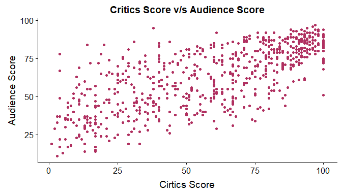
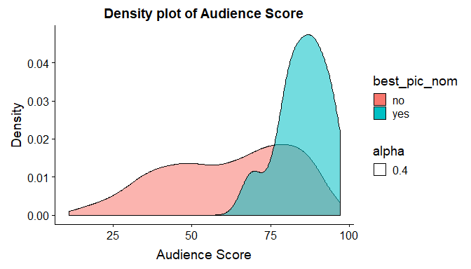
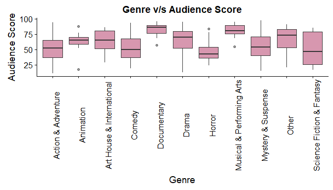
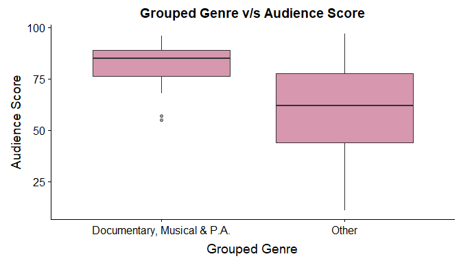
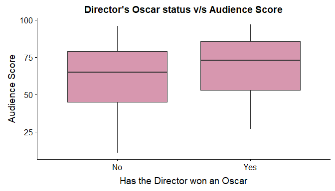
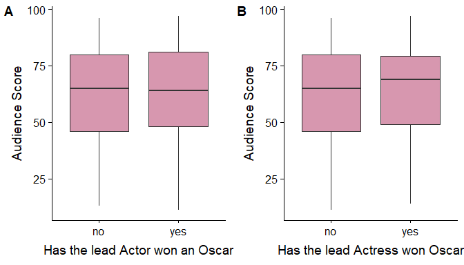

# Modeling and prediction for movies
## Introduction:
A dataset obtained from the IMDb and Rotten Tomatoes website. It consists of a random sample of movies and various attributes related to the movie. Our aim is to identify the attributes of a movie which make them popular among the audience and also make a linear model to predict the popularity of the movie.

Below is a list of attributes/variables that we will be making use of in our study:


* `audience_score`:  The percentage of all Flixster.com and RottenTomatoes.com users who have rated the movie positively.

* `critics_score`: The percentage of professional critic reviews(On Rotten Tomatoes) that are positive for a given movie.

* `best_pic_nom`: Whether or not the movie was nominated for a best picture Oscar (no, yes)

* `best_actor_win`: Whether or not one of the main actors in the movie ever won an Oscar (no, yes) - note that this is not necessarily whether the actor won an Oscar for their role in the given movie.

* `best_actress_win`: Whether or not one of the main actresses in the movie ever won an Oscar (no, yes) - note that this is not necessarily whether the actresses won an Oscar for their role in the given movie.

* `best_dir_win`: Whether or not the director of the movie ever won an Oscar (no, yes) - note that this is not necessarily whether the director won an Oscar for the given movie.

* `genre`: Genre of movie (Action & Adventure, Comedy, Documentary, Drama, Horror, Mystery & Suspense, Other)

A complete codebook for the data can be obtained [here](https://d3c33hcgiwev3.cloudfront.net/_73393031e98b997cf2445132f89606a1_movies_codebook.html?Expires=1540512000&Signature=VDF~xT-BZ9RdHP7Ci2ItYdvOyium9rztu-kqkCx6ploJhWDFr0SClKkTVYUDPkWkq1WlACdBh~nmomHX0JYECxJpjxdn2iaHP5MoP6sRNEtVNTHVTFxpK9gMlHZnaXe-AiqaBhi9tojgh3KZKFOR3E940QnzfCnxSr6fHW9hytE_&Key-Pair-Id=APKAJLTNE6QMUY6HBC5A
)

## Setup

### Load packages


```r
library(ggplot2)
library(dplyr)
library(statsr)
library(cowplot)
```

### Load data


```r
load("movies.Rdata")
```


* * *

## Part 1: Data


```r
dim(movies)
```

```
## [1] 651  32
```

* **Generalisability** : The data consists of a random sample of 651 movies and 32 variables taken from the Rotten Tomatoes and IMDb websites. Both of these websites have more than 100,000 movies in their database. Our sample consists of less than 10 percent of movies listed on these websites. So it is fair to consider the samples to be independent and hence the findings of this study can be generalised to the entire database of movies on those websitess.

* **Causalty** : As this is just an observational study of the data which is already available one cannot draw causal conclusions from the findings of this study. For drawing causal conclusions one must carry out a randomised experiment.

* * *

## Part 2: Research question

In today's time, Showbiz is more about profit making than just producing a cinematic marvel. As a result a lot of investments are made and huge profits are expected. In order to maximize profits one must lure a large audience. The audience's sentiments are clearly captured by the kind of reviews they give. Better reviews would lead to a high theater turnout and increase profits. 

In this study we will try to answer the following questions - 

* **What attributes of a movie affect the audience score?**
* **How well can we predict the audience score using the existing variables?**

We will find which attributes of a movie have a significant effect on the variable `audience_score`.

* * *

## Part 3: Exploratory data analysis

We will begin wit making a plot of Critics score against the Audience score. 


```r
ggplot(movies, aes(x = critics_score, y = audience_score))+geom_point(col = "maroon", pch = 19)+labs(title = "Critics Score v/s Audience Score", x = "Cirtics Score", y = "Audience Score")
```

<!-- -->

In the graph above we observe that there is somewhat a linear relationship between critics Score and the audience score.

We will conduct a hypothesis test to see if Critics score is a significant predictor of Audience score.

 Critics score is a significant predictor of the Audience score.

 Critics score is not a significant predictor of the Audience score.

Mathematically,


Here  is the slope of the predictor variable `critics_score`.


```r
summary(lm(audience_score~critics_score, movies))
```

```
## 
## Call:
## lm(formula = audience_score ~ critics_score, data = movies)
## 
## Residuals:
##     Min      1Q  Median      3Q     Max 
## -37.043  -9.571   0.504  10.422  43.544 
## 
## Coefficients:
##               Estimate Std. Error t value Pr(>|t|)    
## (Intercept)   33.43551    1.27561   26.21   <2e-16 ***
## critics_score  0.50144    0.01984   25.27   <2e-16 ***
## ---
## Signif. codes:  0 '***' 0.001 '**' 0.01 '*' 0.05 '.' 0.1 ' ' 1
## 
## Residual standard error: 14.37 on 649 degrees of freedom
## Multiple R-squared:  0.496,	Adjusted R-squared:  0.4952 
## F-statistic: 638.7 on 1 and 649 DF,  p-value: < 2.2e-16
```

Conducting the test at  significance level, the *p*-value is less than *0.05*. We reject the null hypothesis and conclude that Critcs score is a significant predictor of the Audience score.

***

Next we make a density plot to study the relationship between Oscar nomination status of a movie and the audience score.


```r
ggplot(movies, aes(x = audience_score))+geom_density(aes(fill = best_pic_nom, alpha = 0.4))+labs(title = "Density plot of Audience Score", x = "Audience Score", y = "Density")
```

<!-- -->

The red density plot gives us the distribution of audience scores for movies which are not Oscar nominated. Whereas the turquoise green density plot is the distribution of audience scores for Oscar nominated movies. We observe that Oscar nominated movies have higher audience scores. But is this diference statistically significant? We conduct a hypothesis test to find out.

: The nomination status of a movie is not a significant predictor of the audience score. i.e. 

: The nomination status of a movie is a significant predictor of the audience score. i.e. 


```r
summary(lm(audience_score~best_pic_nom, movies))
```

```
## 
## Call:
## lm(formula = audience_score ~ best_pic_nom, data = movies)
## 
## Residuals:
##    Min     1Q Median     3Q    Max 
## -50.56 -15.56   2.44  16.44  34.44 
## 
## Coefficients:
##                 Estimate Std. Error t value Pr(>|t|)    
## (Intercept)      61.5596     0.7885  78.069  < 2e-16 ***
## best_pic_nomyes  23.7586     4.2894   5.539 4.43e-08 ***
## ---
## Signif. codes:  0 '***' 0.001 '**' 0.01 '*' 0.05 '.' 0.1 ' ' 1
## 8
## Residual standard error: 19.78 on 649 degrees of freedom
## Multiple R-squared:  0.04514,	Adjusted R-squared:  0.04367 
## F-statistic: 30.68 on 1 and 649 DF,  p-value: 4.425e-08
```

Testing at  significance level the *p*-value is less than *0.05*, hence we reject the null hypothesis and conclude that nomination status of a movie is a significant predictor of the audience score. This finding is in line with our intution that Oscar nominated movies would be much more popular and hence have a higher audience score.

***

We will now try to study which genre types tend to be more popular. 


```r
ggplot(movies, aes(x = genre, y = audience_score))+geom_boxplot(fill = "maroon", alpha = 0.5)+labs(title  = "Genre v/s Audience Score", x = "Genre", y = "Audience Score")+theme(axis.text.x = element_text(angle = 90))
```

<!-- -->

Here we make a minute observation that movies with genere type Documentary and Musical & Performing Arts have much higher audience scores. This shows that the audience has a very high liking towards movies with certain genres than others.

We group movies having genre: Documentary and Musical & Preforming Arts, then we store them in a new variable new_genre having two levels: doc_music_pa and other.


```r
movies$new_genre<-as.factor(ifelse(movies$genre %in% c("Documentary","Musical & Performing Arts"), "doc_music_pa", "other"))
```

We will again make a boxplot to see the distribution spread of audience scores for the new grouped genre variable `new_genre`.


```r
ggplot(movies, aes(x = new_genre, y = audience_score))+geom_boxplot(fill = "maroon", alpha = 0.5)+labs(title  = "Grouped Genre v/s Audience Score", x = "Grouped Genre", y = "Audience Score")+scale_x_discrete(labels = c("Documentary, Musical & P.A.", "Other"))
```

<!-- -->

We now test whether the new vairiable is a significant predictor of the audience score.

: New Genre variable is a significant predictor of audience score. i.e. 

: New Genre variable is not a significant predictor of audience score. i.e. 


```r
summary(lm(audience_score~new_genre, movies))
```

```
## 
## Call:
## lm(formula = audience_score ~ new_genre, data = movies)
## 
## Residuals:
##     Min      1Q  Median      3Q     Max 
## -49.193 -14.193   1.807  15.807  36.807 
## 
## Coefficients:
##                Estimate Std. Error t value Pr(>|t|)    
## (Intercept)      82.266      2.392  34.388   <2e-16 ***
## new_genreother  -22.073      2.519  -8.762   <2e-16 ***
## ---
## Signif. codes:  0 '***' 0.001 '**' 0.01 '*' 0.05 '.' 0.1 ' ' 1
## 
## Residual standard error: 19.14 on 649 degrees of freedom
## Multiple R-squared:  0.1058,	Adjusted R-squared:  0.1044 
## F-statistic: 76.77 on 1 and 649 DF,  p-value: < 2.2e-16
```

Here the *p*-value is less than *0.05*, hence we reject the null hypothesis in favour of the alternate.

***

Next we see if the Oscar status of the director of the movie has an effect on the audience score.


```r
ggplot(movies, aes(x = best_dir_win, y = audience_score))+geom_boxplot(fill = "maroon", alpha = 0.5)+labs(title = "Director's Oscar status v/s Audience Score", x = "Has the Director won an Oscar", y = "Audience Score")+scale_x_discrete(labels = c("No","Yes"))
```

<!-- -->

We observe a slightly high audience score for movies having Oscar winning directors. But is this difference merely due to chance or is it significant. We test it out.


```r
summary(lm(audience_score~best_dir_win, movies))
```

```
## 
## Call:
## lm(formula = audience_score ~ best_dir_win, data = movies)
## 
## Residuals:
##     Min      1Q  Median      3Q     Max 
## -50.857 -16.857   3.143  17.143  34.143 
## 
## Coefficients:
##                 Estimate Std. Error t value Pr(>|t|)    
## (Intercept)      61.8569     0.8171  75.701   <2e-16 ***
## best_dir_winyes   7.6547     3.1794   2.408   0.0163 *  
## ---
## Signif. codes:  0 '***' 0.001 '**' 0.01 '*' 0.05 '.' 0.1 ' ' 1
## 
## Residual standard error: 20.15 on 649 degrees of freedom
## Multiple R-squared:  0.008852,	Adjusted R-squared:  0.007325 
## F-statistic: 5.797 on 1 and 649 DF,  p-value: 0.01634
```

The *p*-value of the *t*- test is *0.0163*. We reject the null hypothesis at a significance level of . Thus the Oscar status of the director is a significant predictor of the audience score.

***

Finally, we will check whether the Oscar status of the Actor and the Actress affects the audience score. 


```r
actor<-ggplot(movies, aes(x = best_actor_win, y = audience_score))+geom_boxplot(fill = "maroon", alpha = 0.5)+labs(x = "Has the lead Actor won an Oscar", y = "Audience Score")


actress<-ggplot(movies, aes(x = best_actress_win, y = audience_score))+geom_boxplot(fill = "maroon", alpha = 0.5)+labs(x = "Has the lead Actress won Oscar", y = "Audience Score")

plot_grid(actor, actress, labels = "AUTO")
```

<!-- -->

We observe that the audience scores for movies with Oscar winning Actors and Actresses is similar to the audience scores for movies without Oscar winning Actors and Actresses. This is a counter-intutive finding as one would always expect otherwise. Thus the Oscar status of the Actors and Actresses dont matter when it comes to audience scores.


* * *

## Part 4: Modeling

For building a linear model we will use backward model selection technique with adjusted . Below we discuss which variables should be included in the full model.

* In the previous section we observed that `critics_score`, `best_pic_nom`, `new_genre`and `best_dir_win` were significant predictors of the variable `audience_score`.

* `best_actor_win` and `best_actress_win` are not significant predictors of `audience_score`.

* Among the remaining variables we do not consider variables like `critics_rating` and `audience_rating` because both of these hold similar information as `critics_score` and `audience_score` respectively.

* The IMDb ratings of movies is given by the audience, so using `imdb_rating` of a movie to predict `audience_rating` is redundant. 

* The rest of the variables mostly represent names, dates, url's etc. which are not of much help for prediction. So we drop all those variables.

**Variables in the full model**: `critics_score`,`best_pic_nom`, `new_genre`and `best_dir_win`


```r
full_model<-lm(audience_score~critics_score+best_pic_nom+new_genre+best_dir_win, movies)

summary(full_model)
```

```
## 
## Call:
## lm(formula = audience_score ~ critics_score + best_pic_nom + 
##     new_genre + best_dir_win, data = movies)
## 
## Residuals:
##     Min      1Q  Median      3Q     Max 
## -35.091  -9.407   0.547   9.896  42.934 
## 
## Coefficients:
##                 Estimate Std. Error t value Pr(>|t|)    
## (Intercept)     43.42872    2.51346  17.278  < 2e-16 ***
## critics_score    0.45942    0.02125  21.624  < 2e-16 ***
## best_pic_nomyes 10.47831    3.16988   3.306    0.001 ** 
## new_genreother  -8.79465    1.98153  -4.438 1.07e-05 ***
## best_dir_winyes  0.10066    2.27757   0.044    0.965    
## ---
## Signif. codes:  0 '***' 0.001 '**' 0.01 '*' 0.05 '.' 0.1 ' ' 1
## 
## Residual standard error: 14.1 on 646 degrees of freedom
## Multiple R-squared:  0.5166,	Adjusted R-squared:  0.5136 
## F-statistic: 172.6 on 4 and 646 DF,  p-value: < 2.2e-16
```

For the above model, . We will now execute the backward model selection algorithm.

**Drop `critics_score` from the full model and observe the  value** :


```r
m1<-lm(audience_score~best_pic_nom+new_genre+best_dir_win, movies)

summary(m1)
```

```
## 
## Call:
## lm(formula = audience_score ~ best_pic_nom + new_genre + best_dir_win, 
##     data = movies)
## 
## Residuals:
##     Min      1Q  Median      3Q     Max 
## -47.785 -13.785   2.215  14.347  35.215 
## 
## Coefficients:
##                 Estimate Std. Error t value Pr(>|t|)    
## (Intercept)       82.160      2.313  35.516  < 2e-16 ***
## best_pic_nomyes   24.696      4.068   6.070 2.17e-09 ***
## new_genreother   -23.375      2.444  -9.563  < 2e-16 ***
## best_dir_winyes    6.737      2.961   2.275   0.0232 *  
## ---
## Signif. codes:  0 '***' 0.001 '**' 0.01 '*' 0.05 '.' 0.1 ' ' 1
## 
## Residual standard error: 18.5 on 647 degrees of freedom
## Multiple R-squared:  0.1667,	Adjusted R-squared:  0.1629 
## F-statistic: 43.15 on 3 and 647 DF,  p-value: < 2.2e-16
```

For the model without `critics_score` , which is less than the  value for full model. So we will not drop `critics_score` from our model.

**Drop `best_pic_nom` from the full model and observe the  value** :


```r
m2<-lm(audience_score~critics_score+new_genre+best_dir_win, movies)

summary(m2)
```

```
## 
## Call:
## lm(formula = audience_score ~ critics_score + new_genre + best_dir_win, 
##     data = movies)
## 
## Residuals:
##     Min      1Q  Median      3Q     Max 
## -35.714  -9.309   0.702  10.269  43.199 
## 
## Coefficients:
##                 Estimate Std. Error t value Pr(>|t|)    
## (Intercept)     42.18327    2.50405  16.846  < 2e-16 ***
## critics_score    0.47399    0.02094  22.632  < 2e-16 ***
## new_genreother  -8.01858    1.98261  -4.044 5.88e-05 ***
## best_dir_winyes  1.00032    2.27853   0.439    0.661    
## ---
## Signif. codes:  0 '***' 0.001 '**' 0.01 '*' 0.05 '.' 0.1 ' ' 1
## 
## Residual standard error: 14.21 on 647 degrees of freedom
## Multiple R-squared:  0.5084,	Adjusted R-squared:  0.5062 
## F-statistic: 223.1 on 3 and 647 DF,  p-value: < 2.2e-16
```

For this model  which is less than  for the full model. So we retain `bty_pic_nom` in the model.

**We drop `new_genre` from the full model and observe the  value** :


```r
m3<-lm(audience_score~critics_score+best_pic_nom+best_dir_win, movies)

summary(m3)
```

```
## 
## Call:
## lm(formula = audience_score ~ critics_score + best_pic_nom + 
##     best_dir_win, data = movies)
## 
## Residuals:
##     Min      1Q  Median      3Q     Max 
## -36.634  -9.473   0.434   9.943  43.348 
## 
## Coefficients:
##                 Estimate Std. Error t value Pr(>|t|)    
## (Intercept)     33.77074    1.27594  26.467  < 2e-16 ***
## critics_score    0.49151    0.02026  24.254  < 2e-16 ***
## best_pic_nomyes  8.81140    3.19271   2.760  0.00595 ** 
## best_dir_winyes -0.91150    2.29864  -0.397  0.69184    
## ---
## Signif. codes:  0 '***' 0.001 '**' 0.01 '*' 0.05 '.' 0.1 ' ' 1
## 
## Residual standard error: 14.31 on 647 degrees of freedom
## Multiple R-squared:  0.5019,	Adjusted R-squared:  0.4996 
## F-statistic: 217.3 on 3 and 647 DF,  p-value: < 2.2e-16
```

On droping the variable `new_genre` the  value drops in comparison with the corresponding value for the full model. Thus we cannot drop `new_genre` from the model.

**We drop `best_dir_win` from the full model and observe  value**:


```r
m4<-lm(audience_score~critics_score+best_pic_nom+new_genre, movies)

summary(m4)
```

```
## 
## Call:
## lm(formula = audience_score ~ critics_score + best_pic_nom + 
##     new_genre, data = movies)
## 
## Residuals:
##     Min      1Q  Median      3Q     Max 
## -35.100  -9.410   0.548   9.887  42.933 
## 
## Coefficients:
##                 Estimate Std. Error t value Pr(>|t|)    
## (Intercept)     43.41959    2.50303  17.347  < 2e-16 ***
## critics_score    0.45955    0.02104  21.846  < 2e-16 ***
## best_pic_nomyes 10.49505    3.14474   3.337 0.000894 ***
## new_genreother  -8.78588    1.97005  -4.460 9.68e-06 ***
## ---
## Signif. codes:  0 '***' 0.001 '**' 0.01 '*' 0.05 '.' 0.1 ' ' 1
## 
## Residual standard error: 14.09 on 647 degrees of freedom
## Multiple R-squared:  0.5166,	Adjusted R-squared:  0.5144 
## F-statistic: 230.5 on 3 and 647 DF,  p-value: < 2.2e-16
```

The  value for the model without `best_dir_win` is greater than the  value for the full model. We thus drop `best_dir_win` from our `full_model`.

We now consider `m4` as our base model with  and carry out the same procedure as above. We make the following observations:

* `m4` without `critics_score` yields an  value of *0.1575*
* `m4` without `best_pic_nom` yields an  value of *0.5068*
* `m4` without `new_genre` yields an  value of *0.5002*

Each of these values are less than the  value for our base model `m4`.
Thus we do not drop any further variables and consider `m4` as our final model.


```r
final_model<-m4
summary(final_model)
```

```
## 
## Call:
## lm(formula = audience_score ~ critics_score + best_pic_nom + 
##     new_genre, data = movies)
## 
## Residuals:
##     Min      1Q  Median      3Q     Max 
## -35.100  -9.410   0.548   9.887  42.933 
## 
## Coefficients:
##                 Estimate Std. Error t value Pr(>|t|)    
## (Intercept)     43.41959    2.50303  17.347  < 2e-16 ***
## critics_score    0.45955    0.02104  21.846  < 2e-16 ***
## best_pic_nomyes 10.49505    3.14474   3.337 0.000894 ***
## new_genreother  -8.78588    1.97005  -4.460 9.68e-06 ***
## ---
## Signif. codes:  0 '***' 0.001 '**' 0.01 '*' 0.05 '.' 0.1 ' ' 1
## 
## Residual standard error: 14.09 on 647 degrees of freedom
## Multiple R-squared:  0.5166,	Adjusted R-squared:  0.5144 
## F-statistic: 230.5 on 3 and 647 DF,  p-value: < 2.2e-16
```

Our model explains  the variability in `audience_score`.

The following is the linear equation predicting `audience_score`:


### Interpreting the Linear Model:

* **Intercept**: The model priedicts that a movie-

   1. With $0$ critics score
   2. Which has not been nominated for Oscars
   3. Which has a genre other than Documentary or Musical & Perfroming arts

will get an audience score of *43.42*, this score does not make much sense though, as this is an extrapolation of the model. Which is usually not recommended.

* **Slope of `critics_score`**: All else held constant, for ever unit increase in the critics score, the audience score inncreases by $0.46$ units.

* **Solpe of `best_pic_nom`**: All else held constant, for movies with an Oscar nomination the audience score is *10.45* units higher.

* **Slope of `new_genre`**: All else held constant, for movies with genre- Documentary or Musical & Performing Arts, the audience score is *8.78* units higher.


### Model Diagnostics:

We will check whether all the conditions for a linear model are satisfied. In this model we have only one numerical variable `critics_score` and all the others are categorical. 

**Checking Linearity:** The relationship between `audience_score` and `critics_score` must be linear. We check this condition by plotting `critics_score` against the residuals of `final_model` rather than plotting `audience_score` v/s `critics_score` because this allows us to take into consideration other varibles in the model and not just the bivariate relationship.


```r
ggplot(final_model, aes(x = movies$critics_score, y = .resid))+geom_point(col = "maroon")+geom_hline(yintercept = 0, lty = 2)+labs(title = "Critics score v/s Residuals", x = "Critics scores", y = "Residuals")
```

<!-- -->

There is random scatter around the line passing through $0$. Hence audience score and the critics score are linearly related.

**Checking constant Variability of residuals**: We will plot residuals of the model against the fitted values as this would allow us to consider all the variables in the plot.


```r
ggplot(final_model, aes(x = .fitted, y = .resid))+geom_point(col = "maroon")+geom_hline(yintercept = 0, lty = 2)+labs(title = "Fitted Values v/s Residuals", x = "Fitted Values", y = "Residuals")
```

<!-- -->

One can observe that as we move towards the right hand side, the varibility reduces to some extent. We make a note that this condition is slightly violated. 

**Normality of Residuals**: 


```r
ggplot(final_model, aes(x = .resid))+geom_density(fill = "maroon", alpha = 0.5)+labs(title= "Distribution of Residuals", x = "Residuals", density = "Density")
```

<!-- -->

The distribution of residuals is nearly normal.

**Checking independence of residuals**: 


```r
ggplot(final_model, aes(x = 1:651, y = .resid))+geom_point(col = "maroon")+geom_hline(yintercept = 0, lty = 2)+labs(title = "Plot of residuals by order", x  = "Observations", y = "Residuals")
```

<!-- -->

The residuals are randomly scattered and there is no patterns visible. So we conclude that the residuals are independent. Moreover this also tells us that there is no time series structure to the data.

* * *

## Part 5: Prediction

We will predict the audience score of the movie Hell or High Water, an Oscar nominated movie released in 2016 which got an audience score of  on Rotten Tomatoes.

The movie details are as follows:


```r
movie_info<-data.frame(title = "Hell or High Water", critics_score = 86, best_pic_nom = "yes", new_genre = "other")

movie_info
```

```
##                title critics_score best_pic_nom new_genre
## 1 Hell or High Water            86          yes     other
```

We now predict the audience score of the movie:


```r
predict(final_model, movie_info)
```

```
##        1 
## 84.64975
```

The prediction made by the linear model is pretty close to the actual audience score on Rotten Tomatoes.

Next we make a  prediction interval around this prediction, which will
provide a measure of uncertainty around the prediction.


```r
predict(final_model, movie_info, interval = "prediction", level = 0.90)
```

```
##        fit      lwr     upr
## 1 84.64975 60.91445 108.385
```


Hence, the model predicts, with *90%* confidence, that a movie with a critics score of *86*, having an Oscar nomiation for best movie and whose genre is other than Documentary or Musical & PA is expected to have an audience score between *60.91* 
and *108.38*. 

**Reference**: The data for the movie was obtained from the website of Rotten Tomatoes.

* * *

## Part 6: Conclusion
From our study we come to the following conclusions:

1. The popularity of a movie among the audience is highly influenced by the reviews given by the critics. Better reviews from the critics makes the movies popular among the audience.

2. The popularity of movies varies significantly over different genre types. A movie with genres-Documentary or Musical & Performing Arts tends to be more popular among the audience.

3. Movies with an Oscar nomiation for best picture are more popular.

4. The popularity of a movie does not depend on whether or not the actors or actresses involved in the movie have got an Oscar award.  


